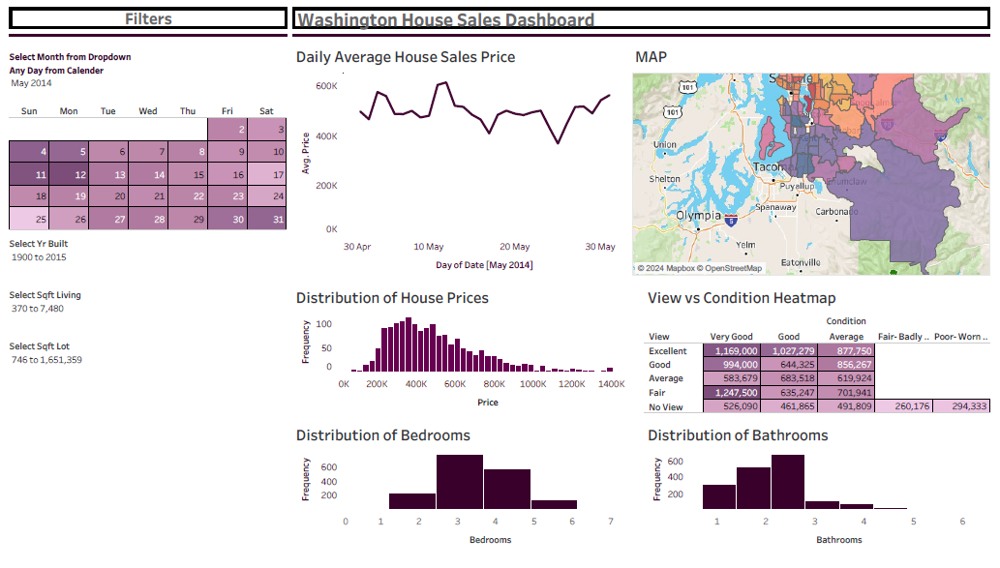

# Washington House Sales Dashboard

This repository showcases an interactive Tableau dashboard analyzing trends in the Washington housing market using historical sales data. It highlights insights into house prices, conditions, and other features across various dimensions.

---

## Dashboard Overview

### [View the Dashboard on Tableau Public](https://public.tableau.com/views/WashingtonHouseSalesDashboard)  
**Objective**: Analyze trends and patterns in Washington's housing market to provide actionable insights for stakeholders.  

**Key Features**:
- **Daily Average House Prices**: Visualize price trends by day.  
- **Price Distribution**: Understand price ranges and their frequency.  
- **View vs. Condition Heatmap**: Explore how property conditions and views impact pricing.  
- **Bedrooms and Bathrooms Analysis**: Frequency distributions of these features to identify market preferences.

---

## Dashboard Preview

---

## Tools Used
- **Tableau Public**: For creating the interactive dashboard.
- **Data Source**: Kaggle
- **Skills Demonstrated**: Data cleaning, visualization, and storytelling through data.

---

## About Me
I am a Master’s in Business Analytics graduate with a passion for deriving actionable insights from data. This project is a demonstration of my data visualization expertise.

---
